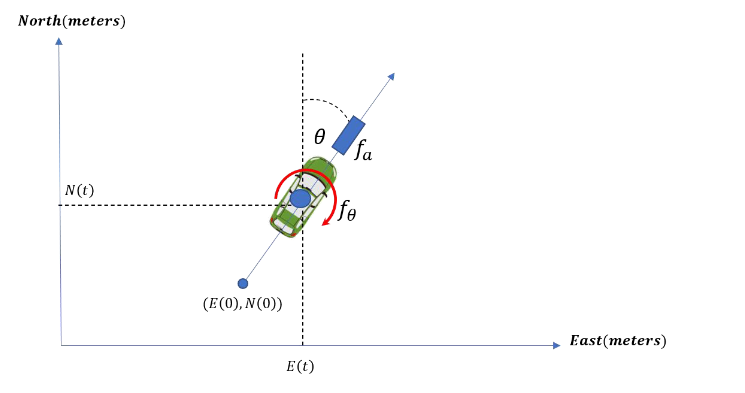
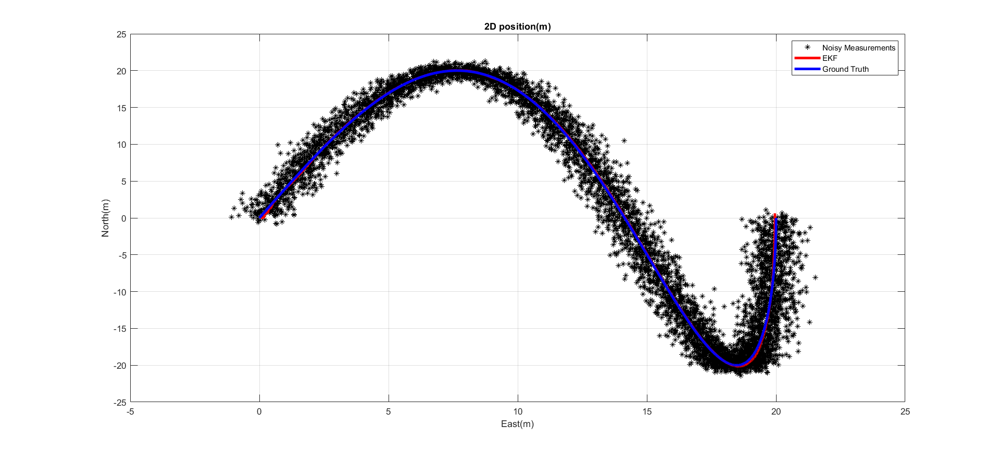
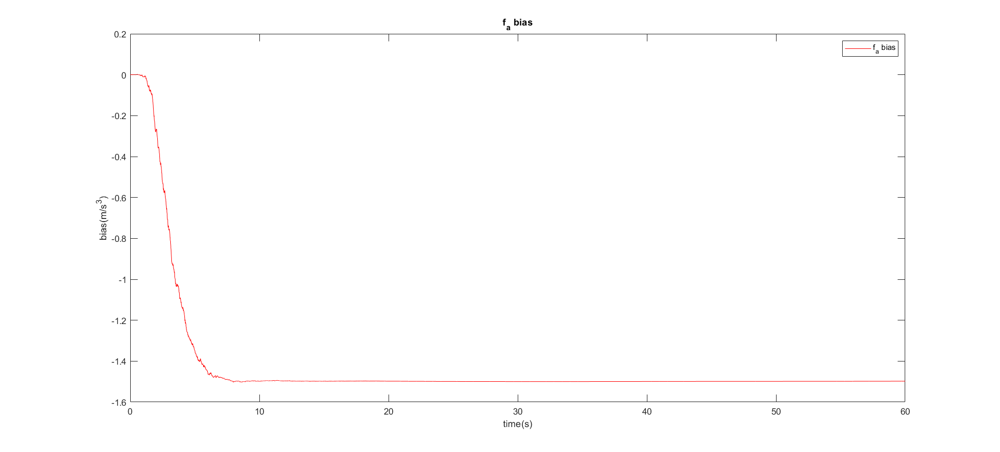
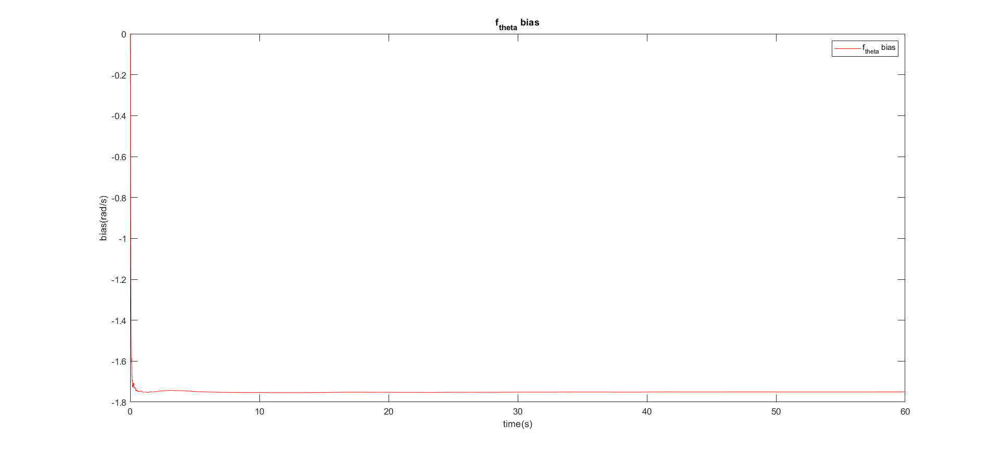

# Fusion-of-2D-Car-Sensors-with-GPS-using-EKF

# 🚗 2D Car Sensor Fusion with GPS Using Extended Kalman Filter (EKF)

This repository contains the implementation of a 2D autonomous car positioning system using an Extended Kalman Filter (EKF). Sensor fusion is performed between noisy control inputs (steering & forward acceleration) and external GPS + magnetometer observations to estimate the vehicle's position, velocity, orientation, and input biases over time.

---

## 🧠 EKF System Overview

### State Vector
\[
\mathbf{x} =
\begin{bmatrix}
E & N & V & a & \theta & b_a & b_\theta
\end{bmatrix}^T
\]

Where:  
- \(E, N\): Position (meters)  
- \(V\): Forward velocity (m/s)  
- \(a\): Acceleration (m/s²)  
- \(\theta\): Azimuth angle (rad)  
- \(b_a, b_\theta\): Sensor input biases  

### Inputs
- Steering control \(f_\theta\) (rad/s)
- Acceleration control \(f_a\) (m/s³)

### Measurements (Noisy)
- GPS East
- GPS North
- Magnetometer Azimuth

## 📊 Results
- 🚘 Trajectory: Noisy Measurements vs EKF vs Ground Truth 

- 🔄 Bias Convergence for \(b_a\) & \(b_\theta\)

